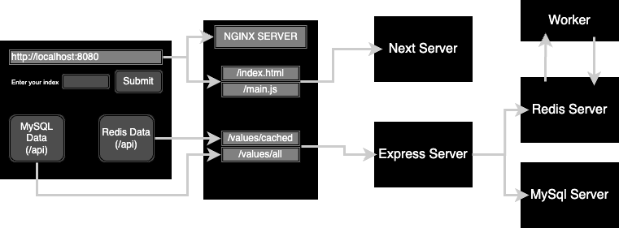
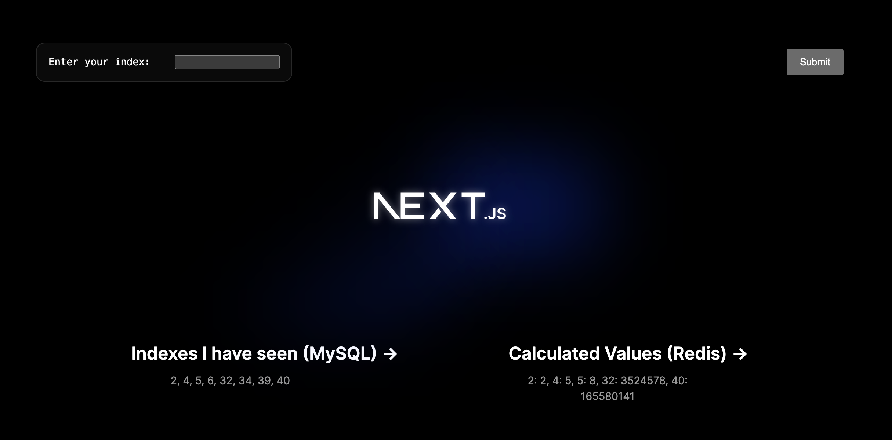

This is a docker compose setup for multi-container apps, depicting an architecture of overly engineered Fibonacci Calculator.

The architecture of the application is as follows:

- We would be accessing our application on `http://localhost:8080`
- NGINX server would be listening on `port 8080`, and would route all `/` requests to Next Server for Client, and all `/api` requests to Express Server (by rewriting requests from `/api` tp `/`).
- Express server would be having the following routes:
  - `[GET] /values/all`: Returns all the indexes given till now from MySql.
  - `[GET] /values/cached`: Returns all the results cached in redis.
  - `[POST] /values`: Pushes index into `"values"` hash set of Redis, publish the index in `"insert"` channel in redis, and inserts the index in MySQL.
- Worker Script would subscribe to `"insert"` channel in redis, and calculates fibonacci number for the received index recursively (so that process takes some time), and pushes index with value back to `"values"` hash set of Redis.

Screenshot of the client application on `http://localhost:8080`:

To setup the application in your local environment:

- cd into the docker-compose-setup directory: `cd docker-and-kubernetes/docker-compose-setup`
- run `docker compose up`
