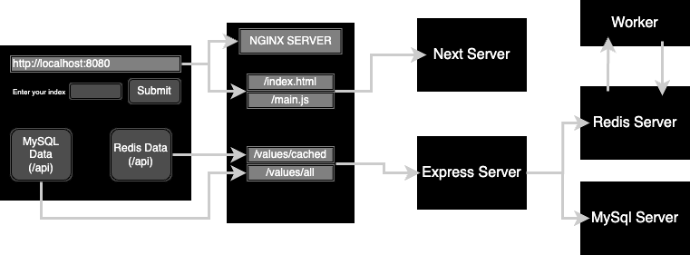
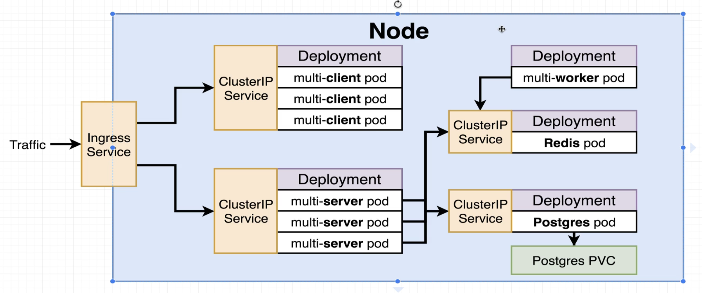

## Multi-Container Application Deployment in Kubernetes

### Overall Architecture

**Application Architecture**


**Kubernetes Architecture**


> NOTE: We would be using **mysql**, instead of **postgres** as shown in the diagram.

### Pre-requisites:

- You should have a running kubernetes cluster. (Minikube or Cloud)

### Setup:

- cd into the folder: `cd kubernetes/3.\ multi-container-app`

### Setting up Nginx Ingress Controller

```bash
kubectl apply -f k8s/ingress-nginx/namespace.yaml
kubectl apply -f k8s/ingress-nginx/service-accounts.yaml
kubectl apply -f k8s/ingress-nginx/roles.yaml
kubectl apply -f k8s/ingress-nginx/cluster-roles.yaml
kubectl apply -f k8s/ingress-nginx/role-bindings.yaml
kubectl apply -f k8s/ingress-nginx/cluster-role-bindings.yaml
kubectl apply -f k8s/ingress-nginx/config-map.yaml
kubectl apply -f k8s/ingress-nginx/services.yaml
kubectl apply -f k8s/ingress-nginx/deployment.yaml
kubectl apply -f k8s/ingress-nginx/jobs.yaml
kubectl apply -f k8s/ingress-nginx/ingress-class.yaml
```

> NOTE: For `minikube`, after the above commands, run: `minikube addons enable ingress`

#### Setting up Client

```bash
kubectl apply -f k8s/client/namespace.yaml
kubectl apply -f k8s/client
```

#### Setting up Redis

```bash
kubectl apply -f k8s/redis/namespace.yaml
kubectl apply -f k8s/redis
```

#### Setting up Worker

```bash
kubectl apply -f k8s/worker/namespace.yaml
kubectl apply -f k8s/worker
```

#### Setting up Mysql

```bash
kubectl apply -f k8s/mysql/namespace.yaml
kubectl create secret generic mysql-password --from-literal MYSQL_ROOT_PASSWORD=password123 -n mysql
kubectl apply -f k8s/mysql
```

#### Setting up Server

```bash
kubectl create secret generic mysql-password --from-literal MYSQL_PASSWORD=password123 -n server
kubectl apply -f k8s/server
```
