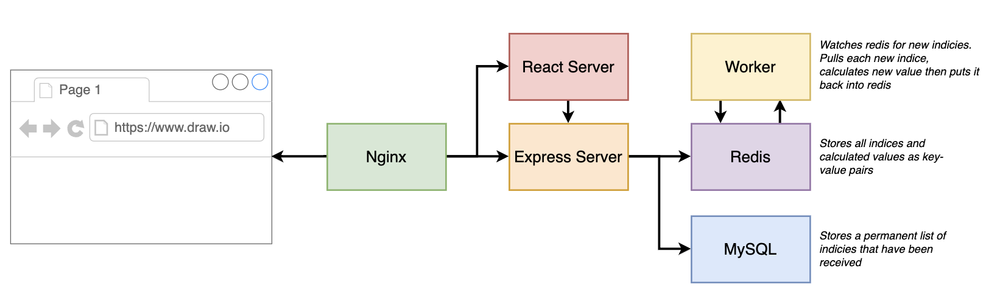
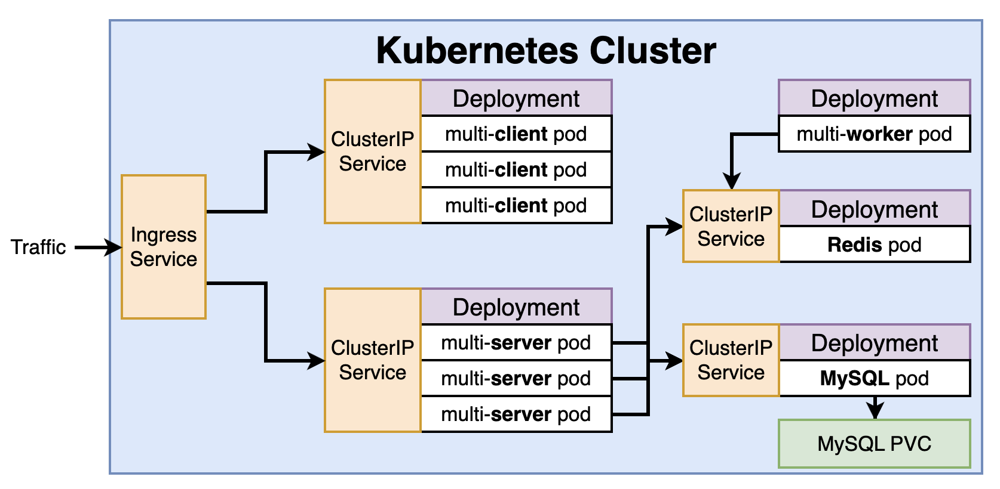

## Multi-Container Application Deployment in Kubernetes (with Helm)

### Overall Architecture

**Application Architecture**


**Kubernetes Architecture**


### Pre-requisites:

- You should have a running kubernetes cluster. (Minikube or Cloud)

### Setup:

- cd into the folder: `cd kubernetes/6.\ multi-container-app`

### Setting up Nginx Ingress Controller

```bash
helm upgrade --install ingress-nginx ingress-nginx --repo https://kubernetes.github.io/ingress-nginx -n ingress-nginx --create-namespace
```

> NOTE: For `minikube`, after the above command, run: `minikube addons enable ingress`
> Also, for HPA to work in below deployments, run `minikube addons enable metrics-server`

#### Setting up Client

```bash
helm upgrade --install client ./k8s/client -f ./k8s/client/values-prod.yaml -n client --create-namespace
```

#### Setting up Redis

```bash
helm upgrade --install redis k8s/redis -f k8s/redis/values-prod.yaml -n redis --create-namespace
```

#### Setting up Worker

```bash
helm upgrade --install worker k8s/worker -f k8s/worker/values-prod.yaml -n worker --create-namespace
```

#### Setting up Mysql

```bash
kubectl create secret generic mysql-password --from-literal MYSQL_ROOT_PASSWORD=password123 -n mysql
helm upgrade --install mysql k8s/mysql -f k8s/mysql/values-prod.yaml -n mysql --create-namespace
```

#### Setting up Server

```bash
kubectl create namespace server
kubectl create secret generic mysql-password --from-literal MYSQL_PASSWORD=password123 -n server
elm upgrade --install server k8s/server -f k8s/server/values-prod.yaml -n server --create-namespace
```
